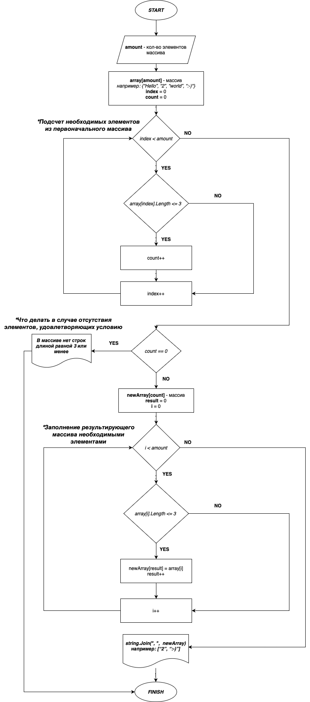

# README file

>_Данная работа необходима для проверки ваших знаний и навыков по итогу прохождения первого блока обучения на программе Разработчик. Мы должны убедится, что базовое знакомство с IT прошло успешно._

>__Задача алгоритмически не самая сложная, однако для полноценного выполнения проверочной работы необходимо:__

>1. Создать репозиторий на GitHub; __+__
>2. Нарисовать блок-схему алгоритма (можно обойтись блок-схемой основной содержательной части, если вы выделяете её в отдельный метод); __+__
>3. Снабдить репозиторий оформленным текстовым описанием решения (файл README.md); __+__
>4. Написать программу, решающую поставленную задачу;  __+__
>5. Использовать контроль версий в работе над этим небольшим проектом (не должно быть так, что всё залито одним коммитом, как минимум этапы 2, 3, и 4 должны быть расположены в разных коммитах) - в проекте - 7-8 commitов; __+__

>__Задача:__ _Написать программу, которая из имеющегося массива строк формирует новый массив из строк, длина которых меньше, либо равна 3 символам. Первоначальный массив можно ввести с клавиатуры, либо задать на старте выполнения алгоритма. При решении не рекомендуется пользоваться коллекциями, лучше обойтись исключительно массивами._

>__Примеры:
[“Hello”, “2”, “world”, “:-)”] → [“2”, “:-)”]
[“1234”, “1567”, “-2”, “computer science”] → [“-2”]
[“Russia”, “Denmark”, “Kazan”] → []__

## Текстовое описание 1-го решения:

> __1. Этап программы:__ метод GetLength, который предлагает ввод количества элементов массива. TryParse() выявит, может ли то, что мы написали, быть числом. Если нет, то этот метод запуститься снова. Иначе вернется переменная amount;  
> __2. Этап программы:__ далее создается массив длиной, равной amount;  
> __3. Этап программы:__ далее запускается метод FillArray, с помощью которого мы заполним массив;  
> __4. Этап программы:__ далее мы выведем готовый массив с помощью метода PrintArray;  
> __5. Этап программы:__ далее мы должны вывести результирующий массив, но прежде должен выполниться метод CreateNewArray. В нем мы сначала ведем подсчет нужных нам элементов в массиве, и создаем новый массив соответствующей размерности. Если таких элементов нет, то мы получаем об этом сообщение и программа выключается. Далее опять начинается цикл с таким же условием, но теперь мы необходимые элементы из первого массива не считаем, а добавляем в результирующий массив.  
> __6. Этап программы:__ выводится результирующий массив.

## Текстовое описание 2-го решения:

> __1. Этап программы:__ метод GetLength, который предлагает ввод количества элементов массива. TryParse() выявит, может ли то, что мы написали, быть числом. Если нет, то этот метод запуститься снова. Иначе вернется переменная amount;  
> __2. Этап программы:__  создаем два массива одинаковой размерности;  
> __3. Этап программы:__ с помощью уже знакомого метода FillArray заполняем один из массивов;  
> __4. Этап программы:__ в методе FillDoubleArray ищем нужные нам элементы и __*сразу же добавляем*__ в новый массив;  
> __5. Этап программы:__ создаем отдельный метод для печати готового массива, так как в нем могут быть пустые ячейки (если не все элементы в первоначальном массиве отвечали заданному условию). В нем если мы доходим до элемента, значение которого равно NULL, то цикл прекращается.

### __*Минус второго решения -  выделенная, но не использованная память для хранения значений массива.*__

